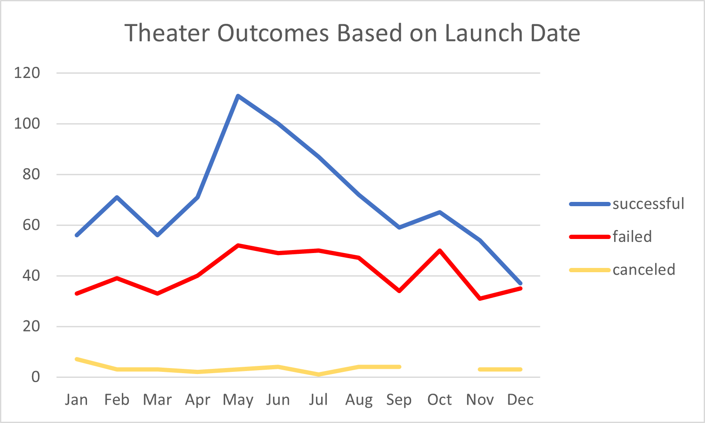
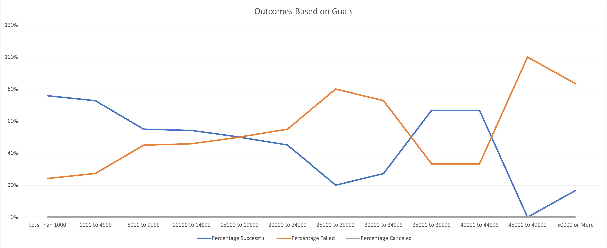

# kickstarter-analysis

## Overview of Project

### Purpose

The purpose of this data analysis was to compare launch dates and funding goals of different campaigns to give Louise a better understanding of how to set up her campaign.

## Analysis and Challenges

### Analysis of Outcomes Based on Launch Date

From the data, I took only theater from the parent category, and created three lines: successful, failed, and canceled. I charted this data over time to find the month where theater had the most success.

### Analysis of Outcomes Based on Goals

From the data, I compared funding goals to success rate. Funding goals were taken in ranges, and percentages of successful, failed, and canceled, were evaluated in those ranges. 

### Challenges and Difficulties Encountered

I did not encounter any challenges, but I can see someone having trouble entering criteria ranges and criteria in the COUNTIFS() function incorrectly - no commas, range and criteria don't match

## Results

- What are two conclusions you can draw about the Outcomes based on Launch Date?

The best month to launch a theater play would be May.

The worst month to launch a theater play would be December.

- What can you conclude about the Outcomes based on Goals?

Campaigns with funding goals of less than $1,000 were successful 76% of the time.

Success rate decreases from funding goals of less than $1000 to $25,000 to $29,999, then begins to increase from $25000 to $35,000.

In total number, most plays were successful in the funding goal range of $1000 to $4999

- What are some limitations of this dataset?

This dataset could be narrowed down to the country Louise wants to put on her theater.

- What are some other possible tables and/or graphs that we could create?

The Outcomes Based on Goals graph would be better represented in a bar graph.

A graph could be made to compare funding goals to pledged amount, to see how far off the failed campaigns were to success.
